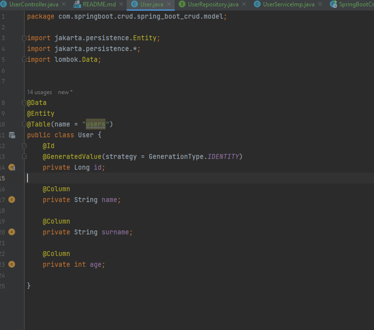
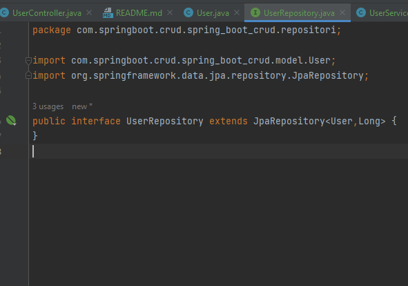
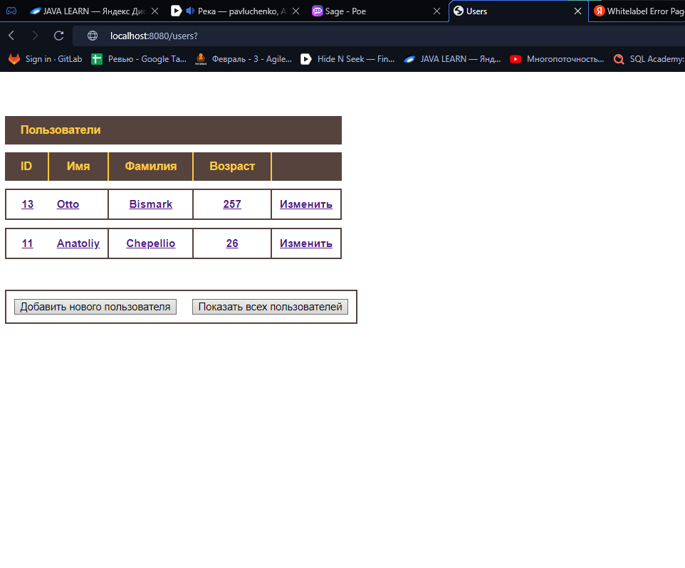

<h3>1.Перевёл мой CRUD API на Spring boot</h3>
 
 
<h3>2.В проекте используется lombok и Интефейст JpaRepositori</h3>
 

 

 

 
<h3>3.Поправил контроллеры.</h3>
 
Теперь обновление пользователя происоходит через тот же метот, что и сохранения, т.к в глубине
 
Метод save() использует merge(), который в свою очередь провеляет наличие такого пользователя
 
<h3>Личные замечания</h3>
 
 
1.Код замметоно сократился, большая часть управления проектом мы делигируем Spring,
 
нам остаётся только написание бизнес-логики
 
2.Сервер "стартует" заметно быстрее

